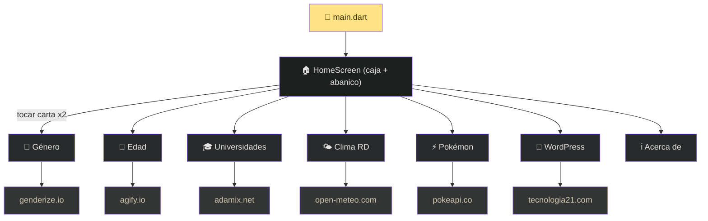

# Caja de Herramientas

Aplicación móvil multiplataforma desarrollada con **Flutter** como parte de la **Tarea 6** del curso *Introducción al Desarrollo de Aplicaciones Móviles*. Reúne 7 mini-herramientas que consumen APIs REST públicas y las presenta dentro de una experiencia inmersiva: una **caja de herramientas roja que cae sobre un banco de trabajo en un garaje** y, al abrirse, despliega un **abanico de cartas interactivo** para elegir cada herramienta.

## Experiencia principal (Home animado)

La pantalla de inicio no es un menú estático, sino una escena animada construida 100% con vectores (`CustomPainter`), sin imágenes externas:

1. 🧰 **La caja cae del cielo** y rebota suavemente al aterrizar sobre la mesa.
2. 👆 Al **tocar la caja**, la tapa se abre en 3D y las herramientas salen **en abanico** por encima de ella.
3. 🃏 El abanico es **interactivo**: deslizas para hojear y **tocas una carta para seleccionarla** (se agranda y resalta). Un **segundo toque** sobre la carta seleccionada **expande la carta hasta convertirse en la pantalla** (efecto *container transform*).
4. 🔄 Al tocar de nuevo la caja, las cartas **regresan a su interior** y la tapa se cierra.

El fondo recrea un **garaje real**: techo de madera, tira de luz LED, pared con *pegboard* y herramientas colgadas (martillo, llave, destornilladores, alicate, serrucho, nivel, cinta métrica), gabinetes rojos con tope de madera y piso de concreto con luz cenital.

## Herramientas incluidas

| Herramienta | Descripción | API utilizada | Efecto de entrada |
|---|---|---|---|
| **Predecir Género** | Predice el género probable de un nombre con porcentaje de confianza | [Genderize.io](https://genderize.io/) | Pop-in del resultado |
| **Predecir Edad** | Estima la edad media asociada a un nombre y la clasifica (Joven / Adulto / Anciano) | [Agify.io](https://agify.io/) | Número que cuenta (count-up) + imagen flotante |
| **Universidades** | Lista universidades de un país con dominios y enlaces web | [Universities List](https://github.com/Hipo/university-domains-list) vía proxy | Tarjetas escalonadas |
| **Clima en RD** | Temperatura actual, humedad, viento y pronóstico de 3 días para Santo Domingo | [Open-Meteo](https://open-meteo.com/) | Temperatura count-up + ícono flotante + pronóstico escalonado |
| **Pokémon** | Información, tipos, estadísticas, imagen oficial y reproducción del grito | [PokéAPI](https://pokeapi.co/) | Sprite flotante + tarjetas escalonadas |
| **Noticias WordPress** | Últimas 3 publicaciones del blog con imagen destacada y enlace al artículo | [tecnologia21.com](https://tecnologia21.com) (REST API) | Noticias escalonadas |
| **Acerca de** | Contacto y presentación del desarrollador | — | Entrada coreografiada + avatar con anillo dorado + microinteracciones |

## Características técnicas

- **Framework:** Flutter 3.x con Dart SDK `^3.12.0`
- **Material Design 3** con tema oscuro personalizado (paleta dorada sobre fondo `#121414`)
- **Tipografía:** Google Fonts (Inter)
- **Gráficos vectoriales:** la caja, el garaje, el banco de trabajo, las herramientas del *pegboard* y la pokébola se dibujan con `CustomPainter` (0 KB de assets, nítidos a cualquier resolución)
- **Animaciones:** caída con rebote, apertura de tapa en 3D (perspectiva con `Matrix4`), abanico interactivo, *container transform* con el paquete `animations` (`OpenContainer`), count-up, pop-in, flotación y entradas escalonadas
- **Consumo de APIs:** paquete `http`
- **Multimedia:** `audioplayers` para gritos de Pokémon, `cached_network_image` para imágenes
- **Enlaces externos:** `url_launcher` para abrir sitios web, correo y teléfono
- **Plataformas soportadas:** Android, iOS, Web, Windows, Linux y macOS

## Estructura del proyecto

```
📁 Tarea5/
│
├── 📄 README.md ..................... Documentación del proyecto
├── 🎨 DESIGN.md ..................... Sistema de diseño y guía de movimiento
├── 🌐 code.html ..................... Prototipo visual de referencia
├── 📦 toolbox_app.apk ............... APK compilado (Android)
│
└── 📱 toolbox_app/ .................. Proyecto Flutter
    │
    ├── 📄 pubspec.yaml .............. Dependencias y configuración
    ├── 🖼️ assets/images/ ............ Recursos gráficos
    │
    └── 📂 lib/
        │
        ├── 🚀 main.dart ............. Punto de entrada de la app
        │
        ├── 🎨 theme/
        │   └── app_theme.dart ....... Tema oscuro, colores, AppCard, AppChip
        │
        ├── 🧩 widgets/ .............. Componentes y animaciones reutilizables
        │   ├── toolbox.dart ......... Caja de herramientas vectorial (estilo URREA)
        │   ├── garage_background.dart  Escena de garaje + banco de trabajo
        │   ├── screen_preview.dart ... Mini-preview que va dentro de cada carta
        │   ├── appear.dart .......... Aparición fade + slide-up escalonada
        │   └── anim.dart ............ CountUp, PopIn y Floating
        │
        └── 📂 screens/
            ├── home_screen.dart ......... Escena animada: caja + abanico interactivo
            ├── gender_screen.dart ....... Predecir género
            ├── age_screen.dart .......... Predecir edad
            ├── universities_screen.dart . Buscar universidades
            ├── weather_screen.dart ...... Clima en Santo Domingo
            ├── pokemon_screen.dart ...... Consultar Pokémon (+ pokébola vectorial)
            ├── wordpress_screen.dart .... Noticias del blog
            └── about_screen.dart ........ Acerca del desarrollador
```

### Flujo de la aplicación



## Requisitos previos

- [Flutter SDK](https://docs.flutter.dev/get-started/install) (3.x o superior)
- Android Studio / VS Code con extensiones de Flutter
- Conexión a internet (todas las herramientas dependen de APIs externas)

## Instalación y ejecución

1. Clona el repositorio:

```bash
git clone https://github.com/yeisondev001/Tarea5.git
cd Tarea5/toolbox_app
```

2. Instala las dependencias:

```bash
flutter pub get
```

3. Ejecuta la aplicación:

```bash
flutter run
```

Para generar un APK de release:

```bash
flutter build apk --release
```

> **Nota web:** varias herramientas consumen APIs de terceros que pueden bloquear las peticiones por **CORS** al correr en navegador. En un dispositivo **Android/iOS** real funcionan con normalidad. Las animaciones se ven igual en todas las plataformas.

## Dependencias principales

| Paquete | Uso |
|---|---|
| `http` | Peticiones GET a APIs REST |
| `google_fonts` | Tipografía Inter |
| `animations` | Transición *container transform* (`OpenContainer`) carta → pantalla |
| `audioplayers` | Reproducir sonidos de Pokémon |
| `cached_network_image` | Caché de imágenes de red |
| `url_launcher` | Abrir URLs, correo y teléfono |

## Diseño y movimiento

La interfaz sigue un sistema de diseño propio documentado en [`DESIGN.md`](DESIGN.md):

- Tema oscuro con acento dorado (`#FFE285`)
- Tarjetas con bordes sutiles y esquinas redondeadas (16px)
- Componentes reutilizables: `AppCard`, `AppChip`
- Sistema de movimiento contenido (curvas `easeOutCubic`/`easeOutBack`, duraciones cortas, *stagger* pequeño) y un *home* con metáfora física de caja de herramientas

## Autor

**Yeison** — [GitHub @yeisondev001](https://github.com/yeisondev001)

> Tarea 6 — Introducción al Desarrollo de Aplicaciones Móviles

## Licencia

Proyecto académico. Uso libre con fines educativos.
