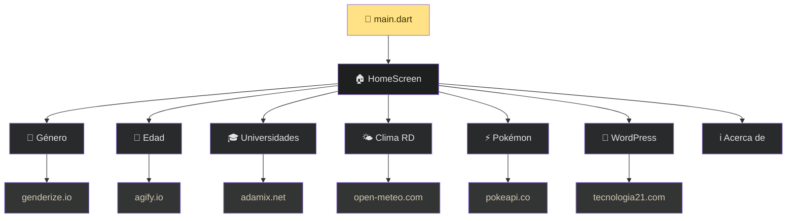

# Caja de Herramientas

Aplicación móvil multiplataforma desarrollada con **Flutter** como parte de la **Tarea 6** del curso *Introducción al Desarrollo de Aplicaciones Móviles*. Reúne 7 mini-herramientas que consumen APIs REST públicas y muestran la información en una interfaz moderna con tema oscuro.

## Capturas y demo

El APK compilado está disponible en la raíz del repositorio: `toolbox_app.apk`.

## Herramientas incluidas

| Herramienta | Descripción | API utilizada |
|---|---|---|
| **Predecir Género** | Predice el género probable de un nombre con porcentaje de confianza | [Genderize.io](https://genderize.io/) |
| **Predecir Edad** | Estima la edad media asociada a un nombre y la clasifica (Joven / Adulto / Anciano) | [Agify.io](https://agify.io/) |
| **Universidades** | Lista universidades de un país con dominios y enlaces web | [Universities List](https://github.com/Hipo/university-domains-list) vía proxy |
| **Clima en RD** | Temperatura actual, humedad, viento y pronóstico de 3 días para Santo Domingo | [Open-Meteo](https://open-meteo.com/) |
| **Pokémon** | Información, tipos, estadísticas, imagen oficial y reproducción del grito | [PokéAPI](https://pokeapi.co/) |
| **Noticias WordPress** | Últimas 3 publicaciones del blog con imagen destacada y enlace al artículo | [tecnologia21.com](https://tecnologia21.com) (REST API) |
| **Acerca de** | Pantalla de contacto y presentación del desarrollador | — |

## Características técnicas

- **Framework:** Flutter 3.x con Dart SDK `^3.12.1`
- **Material Design 3** con tema oscuro personalizado (paleta dorada sobre fondo `#121414`)
- **Tipografía:** Google Fonts (Inter)
- **Consumo de APIs:** paquete `http`
- **Multimedia:** `audioplayers` para gritos de Pokémon, `cached_network_image` para imágenes
- **Enlaces externos:** `url_launcher` para abrir sitios web, correo y teléfono
- **Navegación:** pantalla principal con grid de tarjetas y transiciones fade + slide
- **Plataformas soportadas:** Android, iOS, Web, Windows, Linux y macOS

## Estructura del proyecto

```
📁 Tarea5/
│
├── 📄 README.md ..................... Documentación del proyecto
├── 🎨 DESIGN.md ................... Paleta de colores y diseño UI
├── 🌐 code.html ................... Prototipo visual de referencia
├── 📦 toolbox_app.apk ............. APK compilado (Android)
│
└── 📱 toolbox_app/ ................ Proyecto Flutter
    │
    ├── 📄 pubspec.yaml ............ Dependencias y configuración
    ├── 🖼️ assets/images/ .......... Recursos gráficos
    │
    └── 📂 lib/
        │
        ├── 🚀 main.dart ........... Punto de entrada de la app
        │
        ├── 🎨 theme/
        │   └── app_theme.dart ..... Tema oscuro, colores, AppCard, AppChip
        │
        └── 🧩 screens/
            ├── home_screen.dart .......... Menú principal (grid de herramientas)
            ├── gender_screen.dart ........ Predecir género
            ├── age_screen.dart ........... Predecir edad
            ├── universities_screen.dart .. Buscar universidades
            ├── weather_screen.dart ....... Clima en Santo Domingo
            ├── pokemon_screen.dart ....... Consultar Pokémon
            ├── wordpress_screen.dart ..... Noticias del blog
            └── about_screen.dart ......... Acerca del desarrollador
```

### Flujo de la aplicación



## Requisitos previos

- [Flutter SDK](https://docs.flutter.dev/get-started/install) (3.x o superior)
- Android Studio / VS Code con extensiones de Flutter
- Conexión a internet (todas las herramientas dependen de APIs externas)

## Instalación y ejecución

1. Clona el repositorio:

```bash
git clone https://github.com/yeisondev001/Tarea5.git
cd Tarea5/toolbox_app
```

2. Instala las dependencias:

```bash
flutter pub get
```

3. Ejecuta la aplicación:

```bash
flutter run
```

Para generar un APK de release:

```bash
flutter build apk --release
```

## Dependencias principales

| Paquete | Uso |
|---|---|
| `http` | Peticiones GET a APIs REST |
| `google_fonts` | Tipografía Inter |
| `audioplayers` | Reproducir sonidos de Pokémon |
| `cached_network_image` | Caché de imágenes de red |
| `url_launcher` | Abrir URLs, correo y teléfono |

## Diseño

La interfaz sigue un sistema de diseño propio definido en `DESIGN.md`, con:

- Tema oscuro con acento dorado (`#FFE285`)
- Tarjetas con bordes sutiles y esquinas redondeadas (16px)
- Componentes reutilizables: `AppCard`, `AppChip`
- Animaciones de presión en las tarjetas del menú principal

## Autor

**Yeison** — [GitHub @yeisondev001](https://github.com/yeisondev001)

> Tarea 6 — Introducción al Desarrollo de Aplicaciones Móviles

## Licencia

Proyecto académico. Uso libre con fines educativos.
