<div align="center">

# 🧰 Caja de Herramientas

### Una app móvil que se siente como abrir una caja de herramientas real

[](https://flutter.dev/)
[](https://dart.dev/)
[](https://m3.material.io/)
[](#)

**7 herramientas · 6 APIs públicas · 6 sonidos sintetizados · 0 imágenes para los gráficos**

</div>

---

## ✨ ¿Qué hace especial esta app?

> No es una lista de menú. Es una **escena interactiva**: una caja roja cae del cielo sobre el banco de trabajo de un garaje, rebota, y al tocarla se abre desplegando un abanico de cartas — cada una con sonido propio, vibración háptica y transiciones cinemáticas.

```
       🧰 ← cae con gravedad real (Curves.bounceOut)
        ↓   thud × 3 (en cada rebote, volumen decreciente)
   ════════ ← banco de trabajo de madera
        ↓
      *clic* → tapa se abre con chirrido
        ↓
   🃏 🃏 🃏 🃏 🃏 🃏 🃏 ← 7 cartas en abanico
        ↓
     *tap*  → carta se expande hasta llenar la pantalla
```

---

## 🛠️ Las 7 herramientas

| | Herramienta | Qué hace | API |
|:---:|---|---|---|
| 👤 | **Predecir Género** | Predice género de un nombre con % de confianza | [genderize.io](https://genderize.io/) |
| 🎂 | **Predecir Edad** | Estima edad media de un nombre (Joven/Adulto/Anciano) | [agify.io](https://agify.io/) |
| 🎓 | **Universidades** | Lista universidades por país con dominios | [hipolabs](http://universities.hipolabs.com/) |
| 🌤️ | **Clima en RD** | Tiempo en Santo Domingo + 3 días de pronóstico | [open-meteo](https://open-meteo.com/) |
| ⚡ | **Pokémon** | Stats, tipos, sprite y grito del Pokémon | [pokeapi](https://pokeapi.co/) |
| 📰 | **Noticias WP** | Últimas 3 publicaciones del blog | [tecnologia21.com](https://tecnologia21.com) |
| ℹ️ | **Acerca de** | Contacto del desarrollador con enlaces vivos | — |

---

## 🎬 Cómo se siente — animaciones y feedback

| Momento | Visual | Sonido | Vibración |
|---|---|:---:|:---:|
| 🚀 Abre la app | Caja cae 2.2s con `bounceOut` | — | — |
| 🥁 **Rebote 1** | Toca el banco (impacto fuerte) | 🔊 `thud` 100% | 📳 Fuerte |
| 🥁 **Rebote 2** | Salto menor | 🔊 `thud` 55% | — |
| 🥁 **Rebote 3** | Asentamiento | 🔊 `thud` 28% | — |
| 👆 Tocas la caja | Tapa abre 750ms con `easeOutBack` | 🔊 `lid_open` | 📳 Medio |
| 🌟 Cartas salen | Abanico desplegándose en arco | 🔊 `fan_spread` | 📳 Suave |
| 🃏 Tocas carta | Carta se centra y agranda | 🔊 `card_tap` | 📳 Selección |
| 🚪 Tocas de nuevo | Carta se expande a pantalla completa | 🔊 `screen_open` | 📳 Suave |
| 🔒 Cierras la caja | Tapa baja, *clack* de madera | 🔊 `box_close` | 📳 Medio |

---

## 🎨 ¿Por qué se ve tan nítido? — Todo es vectorial

Los gráficos NO son PNGs. Se dibujan con **`CustomPainter`** (la API de Canvas de Flutter) — código matemático que genera la imagen en tiempo real:

```dart
// ejemplo: la tapa de la caja, en lugar de un PNG
final path = Path()
  ..moveTo(x1, y1)
  ..quadraticBezierTo(cx, cy, x2, y2)
  ..close();
canvas.drawPath(path, redGradientPaint);
```

| Elemento | Cómo se hizo |
|---|---|
| 🧰 **Caja roja** estilo URREA | `CustomPainter` con 7 tonos de rojo + gradientes + sombras |
| 🏚️ **Fondo del garaje** | `CustomPainter`: pared, techo de madera, viga, LED, pegboard con herramientas colgadas, gabinete, piso |
| 📱 **Mini-preview** dentro de cada carta | `Container` + `BoxDecoration` (app bar simulada + ícono en círculo dorado + filas falsas) |
| 🎯 **Íconos** | Material Icons (vectoriales) de Flutter |

**Beneficios:** nítido en cualquier DPI · APK más liviano · animable (la tapa abre porque es un `Path`, no un sprite) · tematizable.

---

## 🔊 ¿Y los sonidos? — Sintetizados con matemática

Los 6 WAV NO se descargaron. Se generaron con un script Python que escribe ondas muestra por muestra:

```python
# thud: golpe grave (caja cayendo)
tone = sin(2π · 70 · t) + sin(2π · 40 · t) · 0.6   # mezcla 70+40 Hz
noise = random() · 0.25                              # → simula el "golpe seco"
envelope = e^(-18·t)                                 # → decay rápido
sample = (tone + noise) · envelope · 0.65
```

| Sonido | Receta | Duración | Peso |
|---|---|:---:|:---:|
| `thud.wav` | Senos 70+40Hz + ruido + decay rápido | 300 ms | 12 KB |
| `lid_open.wav` | Barrido 200→700 Hz (chirrido) | 220 ms | 9 KB |
| `fan_spread.wav` | Barrido 800→220 Hz (whoosh) | 280 ms | 12 KB |
| `card_tap.wav` | Seno 1000 Hz, decay ultra-corto | 65 ms | 2 KB |
| `screen_open.wav` | Barrido 1200→1800 Hz (campanilla) | 140 ms | 6 KB |
| `box_close.wav` | Barrido 280→90 Hz + armónico + ruido | 180 ms | 7 KB |

**Total: ~47 KB para los 6 sonidos.** El script (`assets/audio/gen_sounds.py`) es la receta — si quieres ajustar tonos, editas la fórmula y regeneras.

> ⚠️ Python NO se ejecuta en tu celular. Es solo la herramienta que creó los assets (como Photoshop crearía un PNG). La app que corre en el dispositivo es **100% Dart/Flutter**.

---

## 🏗️ Arquitectura del proyecto

La app se organiza en **4 capas claramente separadas** — desde lo que ve el usuario hasta los servicios externos:

```mermaid
flowchart TB
    subgraph L1["🧑 CAPA DE USUARIO"]
        User(["👆 Toca la pantalla"])
    end

    subgraph L2["🎬 CAPA DE PANTALLAS · lib/screens/"]
        direction LR
        HomeS["🏠 home_screen<br/><i>escena animada</i>"]
        G["👤 gender"]
        E["🎂 age"]
        U["🎓 universities"]
        W["🌤️ weather"]
        P["⚡ pokemon"]
        N["📰 wordpress"]
        A["ℹ️ about"]
    end

    subgraph L3["🧩 CAPA DE WIDGETS · lib/widgets/"]
        direction LR
        TB["🧰 toolbox<br/><i>CustomPainter</i>"]
        GB["🏚️ garage_background<br/><i>CustomPainter</i>"]
        SP["📱 screen_preview"]
        AN["✨ anim<br/><i>CountUp · PopIn · Float</i>"]
        AP["📥 appear<br/><i>fade + slide</i>"]
    end

    subgraph L4["⚙️ CAPA DE SERVICIOS · lib/services/ & theme/"]
        direction LR
        SS["🔊 SoundService<br/><i>audio + háptica</i>"]
        TH["🎨 app_theme<br/><i>colores · AppCard</i>"]
    end

    subgraph L5["🌍 RECURSOS EXTERNOS"]
        direction LR
        APIs[("🌐 6 APIs REST")]
        Assets[("📦 yeison.jpg<br/>+ 6 WAVs")]
    end

    User --> HomeS
    HomeS --> G & E & U & W & P & N & A
    HomeS -.usa.-> TB & GB & SP
    G & E & U & W & P & N --> AN & AP
    HomeS -.dispara.-> SS
    L2 -.estiliza con.-> TH
    G & E & U & W & P & N -.fetch.-> APIs
    SS -.lee.-> Assets

    style L1 fill:#1A1C1D,stroke:#FFE285,stroke-width:2px,color:#FFE285
    style L2 fill:#1E2020,stroke:#DE3B2E,stroke-width:2px,color:#E2E2E2
    style L3 fill:#1E2020,stroke:#7BA7E3,stroke-width:2px,color:#E2E2E2
    style L4 fill:#1E2020,stroke:#9CD67D,stroke-width:2px,color:#E2E2E2
    style L5 fill:#1E2020,stroke:#CFC6AF,stroke-width:2px,color:#E2E2E2

    style User fill:#FFE285,color:#3B2F00,stroke:#3B2F00,stroke-width:2px
    style HomeS fill:#DE3B2E,color:#fff,stroke:#7E120B,stroke-width:2px
    style G fill:#282A2B,color:#E2E2E2
    style E fill:#282A2B,color:#E2E2E2
    style U fill:#282A2B,color:#E2E2E2
    style W fill:#282A2B,color:#E2E2E2
    style P fill:#282A2B,color:#E2E2E2
    style N fill:#282A2B,color:#E2E2E2
    style A fill:#282A2B,color:#E2E2E2
    style TB fill:#2A3540,color:#A8C8E8
    style GB fill:#2A3540,color:#A8C8E8
    style SP fill:#2A3540,color:#A8C8E8
    style AN fill:#2A3540,color:#A8C8E8
    style AP fill:#2A3540,color:#A8C8E8
    style SS fill:#2A4029,color:#B0D69D
    style TH fill:#2A4029,color:#B0D69D
    style APIs fill:#333535,color:#CFC6AF
    style Assets fill:#333535,color:#CFC6AF
```



<details>
<summary><b>📂 Ver árbol de archivos completo</b></summary>

```
📁 Tarea5/
│
├── 📄 README.md                        ← este archivo
├── 🎨 DESIGN.md                        ← sistema de diseño
├── 📦 toolbox.apk                      ← APK release (49 MB)
│
└── 📱 toolbox_app/                     ← Proyecto Flutter
    │
    ├── 📄 pubspec.yaml                 ← dependencias y assets
    │
    ├── 🖼️  assets/
    │   ├── images/yeison.jpg           ← foto (único raster)
    │   └── audio/                      ← 6 WAVs + gen_sounds.py
    │
    └── 📂 lib/
        ├── 🚀 main.dart                ← entry point
        │
        ├── 🎨 theme/
        │   └── app_theme.dart          ← colores, AppCard, AppChip
        │
        ├── 🔊 services/
        │   └── sound_service.dart      ← singleton audio + háptica
        │
        ├── 🧩 widgets/
        │   ├── toolbox.dart            ← caja roja vectorial
        │   ├── garage_background.dart  ← garaje vectorial
        │   ├── screen_preview.dart     ← preview en cartas
        │   ├── appear.dart             ← fade + slide
        │   └── anim.dart               ← CountUp, PopIn, Floating
        │
        └── 📂 screens/                 ← 1 archivo por herramienta
            ├── home_screen.dart        ← 🎬 escena animada
            ├── gender_screen.dart      ← 👤
            ├── age_screen.dart         ← 🎂
            ├── universities_screen.dart← 🎓
            ├── weather_screen.dart     ← 🌤️
            ├── pokemon_screen.dart     ← ⚡
            ├── wordpress_screen.dart   ← 📰
            └── about_screen.dart       ← ℹ️
```

</details>

---

## 🔄 Flujo de la aplicación

```mermaid
flowchart LR
    A([📱 Abrir app]):::start --> B[🧰 Caja cae]:::main
    B --> C[👆 Tocar caja]:::main
    C --> D[🃏 Abanico de cartas]:::main
    D --> E[👆 Elegir herramienta]:::main
    E --> F([🛠️ Herramienta]):::end

    style A fill:#FFE285,color:#3B2F00,stroke:#3B2F00,stroke-width:2px
    style F fill:#DE3B2E,color:#fff,stroke:#7E120B,stroke-width:2px
    classDef start fill:#FFE285,color:#3B2F00,stroke:#3B2F00,stroke-width:2px
    classDef main fill:#282A2B,color:#E2E2E2,stroke:#4A4F52,stroke-width:1.5px
    classDef end fill:#DE3B2E,color:#fff,stroke:#7E120B,stroke-width:2px
```

---

### ⚙️ Anatomía técnica — cómo se coordina un rebote

```mermaid
sequenceDiagram
    autonumber
    actor U as 👤 Usuario
    participant H as 🏠 HomeScreen
    participant F as ⏱️ _fall<br/>AnimationController
    participant S as 🔊 SoundService
    participant A as 🎵 audioplayers
    participant V as 📳 HapticFeedback

    U->>H: abre la app
    H->>F: forward() · 2.2s · bounceOut
    activate F

    rect rgb(58, 46, 26)
        Note over F: ⏰ t=0.36 → impacto 1
        F->>S: play(thud, volume: 1.0)
        S->>V: heavyImpact()
        V-->>U: 📳📳📳
        S->>A: AssetSource('thud.wav')
        A-->>U: 🔊 ¡PUM!
    end

    rect rgb(50, 40, 22)
        Note over F: ⏰ t=0.73 → impacto 2
        F->>S: play(thud, volume: 0.55)
        S->>A: AssetSource('thud.wav')
        A-->>U: 🔊 pum
    end

    rect rgb(42, 34, 19)
        Note over F: ⏰ t=0.91 → impacto 3
        F->>S: play(thud, volume: 0.28)
        S->>A: AssetSource('thud.wav')
        A-->>U: 🔊 toc
    end

    F-->>H: status: completed
    deactivate F
    H->>H: setState(_landed = true)
    Note over H: ✅ Caja asentada · lista para abrir
```



---

## 📦 Dependencias

| Paquete | Para qué |
|---|---|
| [`http`](https://pub.dev/packages/http) | Llamadas GET a las 6 APIs |
| [`url_launcher`](https://pub.dev/packages/url_launcher) | Abrir GitHub/LinkedIn/email/teléfono desde "Acerca de" |
| [`audioplayers`](https://pub.dev/packages/audioplayers) | Reproducir los WAV con control de volumen |
| [`cached_network_image`](https://pub.dev/packages/cached_network_image) | Cache de sprites de Pokémon |
| [`google_fonts`](https://pub.dev/packages/google_fonts) | Tipografía Inter consistente |
| [`animations`](https://pub.dev/packages/animations) | `OpenContainer` (transición carta → pantalla) |
| [`flutter_launcher_icons`](https://pub.dev/packages/flutter_launcher_icons) | Generar el ícono de la app |

---

## 🚀 Cómo correrlo

```bash
# Clonar
git clone https://github.com/yeisondev001/Tarea5.git
cd Tarea5/toolbox_app

# Dependencias
flutter pub get

# Ejecutar en modo debug
flutter run

# O construir APK release (Android)
flutter build apk --release
```

> 💡 **Para web:** usar `flutter build web --release` y servir `build/web` con cualquier HTTP server. El modo debug en Chrome demora 1-2 minutos en cargar CanvasKit la primera vez — release es instantáneo.

---

## 🧠 Decisiones técnicas y problemas resueltos

| Reto | Solución |
|---|---|
| 🐌 Modo debug web tardaba 2 min en cargar | Build release + Python HTTP server |
| 💥 APK fallaba con path "Introducción al desarrollo..." | Trabajo desde `C:\tarea6` (path ASCII) y sync con `robocopy` |
| 📸 La foto cortaba la frente | `ClipOval` + `alignment: Alignment(0, -0.6)` |
| 🔗 URLs largas desbordaban el "Acerca de" | Texto corto + URL real solo al tap |
| 🌡️ Temperatura grande desbordaba el card | `FittedBox(fit: BoxFit.scaleDown)` |
| 🎞️ Lag con fondo repintándose 60 FPS | `RepaintBoundary` alrededor de `GarageBackground` |
| 🔊 Sonido sonaba solo al final del rebote | Listener detecta 3 momentos clave (`t=0.36/0.73/0.91`) y dispara `thud` con volumen decreciente |

---

## 👤 Autor

**Yeison Gregori Rojas Henríquez**
Matrícula: `20241822`

- 🐙 GitHub: [@yeisondev001](https://github.com/yeisondev001)
- 💼 LinkedIn: [yeison-rojas-henriquez](https://www.linkedin.com/in/yeison-rojas-henriquez)
- 📧 Email: yeisonrojass03@gmail.com
- 📱 +1 (829) 801-9374

> *Tarea 6 — Introducción al Desarrollo de Aplicaciones Móviles*

---

<div align="center">

**100% Flutter · 100% Vectorial · 100% Sintetizado**

🧰 Hecho con cariño y mucho `CustomPainter` 🧰

</div>
